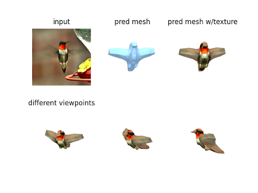

# Self-Supervised Single View 3D-Reconstruction

## Examples
#### 3D-Reconstruction


#### Part segmentation with 4 parts
  

#### Vertex part segmentation with 7 parts
 

## Requiremets
Python 3 \
PyTorch >= 1.4.0 \
In a new ``conda`` or ``virtualenv`` environment run
```
pip install -r requirements.txt
```

## Dependencies
#### SoftRas renderer
Install the [SoftRas](https://arxiv.org/abs/1904.01786) renderer
```
git clone https://github.com/ShichenLiu/SoftRas.git
cd SoftRas
python setup.py install
```
#### Chamfer distance
Install [this](https://github.com/krrish94/chamferdist) PyTorch module to compute Chamfer distance between two point clouds
```
git clone https://github.com/krrish94/chamferdist
cd chamferdist
python setup.py install
```
#### Perceptual Similarity
Install the Perceptual Similarity loss
```
git clone https://github.com/shubhtuls/PerceptualSimilarity.git
```

## Other pre-requisites
#### CUB Data
Download CUB-200-2011 images
```
cd misc && wget http://www.vision.caltech.edu/visipedia-data/CUB-200-2011/CUB_200_2011.tgz && tar -xf CUB_200_2011.tgz
```
#### CUB annotation mat files and pre-computed SfM outputs
Download CUB annotation mat files and pre-computed SfM outputs, from [here](https://drive.google.com/file/d/1Zr4ZN5Hbev2epLn0v2sHYVdyUAJt_dZB/view?usp=sharing). This should be saved in the ``misc/cachedir`` directory.

## Model training
Start `visdom.server` before training
```
nohup python -m visdom.server
```
See `main.py` to adjust hyper-parameters (for eg. increase `tex_loss_wt` and `text_dt_loss_wt` if you want better texture or increase texture resolution with `tex_size`). See `nnutils/mesh_net.py` and `nnutils/train_utils.py` for more model/training options.
```
python  main.py --name=<experiment_name> --display_port 8097
```
More settings
```
# Stronger texture & higher resolution texture.
python main.py --name=better_texture --tex_size=6 --tex_loss_wt 1. --tex_dt_loss_wt 1. --display_port 8088

# Stronger texture & higher resolution texture + higher res mesh. 
python main.py --name=hd --tex_size=6 --tex_loss_wt 1. --tex_dt_loss_wt 1. --subdivide 4 --display_port 8089
```

## Evaluation
The command below runs the model with different camera settings.
```
python misc/benchmark/run_evals.py --split val --name <experiment_name> --num_train_epoch <number_of_epochs_trained>
```
Then, run 
```
python misc/benchmark/azele_plot.py --split val --name <experiment_name> --num_train_epoch <number_of_epochs_trained>
```
to generate azimuth-elevation plots for the camera distribution, and
```
python misc/benchmark/plot_curvess.py --split val --name <experiment_name> --num_train_epoch <number_of_epochs_trained>
```
in order to see the IOU curve.

